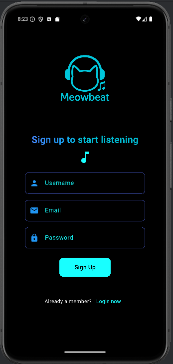

# 🎵 Meowbeat – Music Streaming App

Meowbeat is a cross-platform music streaming and playlist management application built with **Flutter** and a lightweight **Java TCP server**.  
It provides essential features like user authentication, profile management, playlist creation/import, and a full music player interface.

---

## 📱 Features

- **User Authentication**
    - Sign up and log in with a username, email, and password
- **Profile Management**
    - Update email and password
    - Change profile picture
    - Switch between light and dark mode
    - Delete account
- **Home Page**
    - Displays user playlists and popular songs
- **Explore Page**
    - Browse and discover music
- **Song Player**
    - Play / pause / skip songs
    - Show song details and cover art
- **Playlist Management**
    - Create new playlists
    - Import playlists from JSON
- **Theme Switching**
    - Toggle between dark and light mode

---

## 🚀 Getting Started

### Prerequisites
- [Flutter SDK](https://flutter.dev/docs/get-started/install) (3.x or later recommended)
- Android Studio or VS Code (for running the mobile app)
- IntelliJ IDEA (for running the Java TCP server)
- An Android device or emulator

### Installation & Run

1. **Clone the repository**
   ```bash
   git clone https://github.com/USERNAME/meowbeat.git
   cd meowbeat
 2. **Flutter app**
       ```bash
      flutter pub get
      flutter run
 3. **Java TCP server**

    • Open the server/ folder (or your Java source files) in IntelliJ IDEA

    • Build and run the SimpleServer.java class
   
    • Make sure the server is running on the same IP/port configured in the Flutter app (default: 192.168.x.x:12344)
### 📂 Project Structure
 ```bash
        lib/
        ├─ main.dart                  # App entry point
        ├─ pages/
        │   ├─ login_page.dart        # Login screen
        │   ├─ signup_page.dart       # Signup screen
        │   ├─ main_page.dart         # Bottom navigation (Home / Explore / Profile)
        │   ├─ home_page.dart         # Home page (playlists & songs)
        │   ├─ explore_page.dart      # Explore page
        │   ├─ song_player_page.dart  # Song player screen
        │   ├─ playlist_detail_page.dart # Playlist details
        │   └─ profile_page.dart      # User profile
        ├─ models/
        │   ├─ playlist.dart          # Playlist model
        │   └─ song.dart              # Song model
        server/
        └─ SimpleServer.java          # Java TCP server implementation
```
### 📸 Screenshots
| Login Screen                           | Signup Screen                            | Home Page                                | Explore Page                               | Profile Page                               |
|----------------------------------------|------------------------------------------|------------------------------------------|--------------------------------------------|--------------------------------------------|
|  |  |   |  |  | 
### 📜 License
This project is licensed under the MIT License
– feel free to use, modify, and distribute.